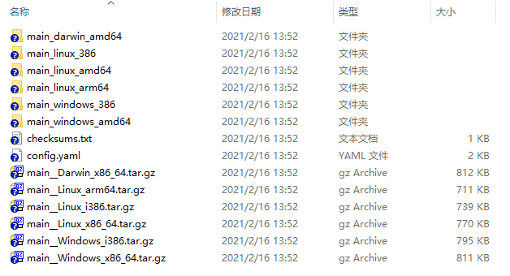

# GoReleaser 魔改版

 [https://github.com/goreleaser/goreleaser](https://github.com/goreleaser/goreleaser)

去除不必要的功能

一键交叉编译多平台的go二进制程序

[cmd/release.go](cmd/release.go)

[internal/builders/golang/build.go](/internal/builders/golang/build.go)

[internal/pipeline/pipeline.go](/internal/pipeline/pipeline.go)

[internal/pipe/defaults/defaults.go](/internal/pipe/defaults/defaults.go)

[internal/pipe/build/build.go](internal/pipe/build/build.go)

## 从源代码编译

```
go build -o goreleaser.exe .
```

## 从Github Release 下载二进制文件

> Github Release 在 页面的右侧

## 添加环境变量

把 `goreleaser.exe` 放到一个自己创建的目录中, 将目录 加入 环境变量

> 添加环境变量后, 再打开cmd , 才能生效.

## 执行相关命令

打开cmd/ powershell 

cd 到  欲发布的go项目根目录 . 例如 `E:\Work\GoProject\GoBuildDocsifySidebar`

> 首次构建需要先执行 `goreleaser init`  
>
> 自动创建  `.goreleaser.yml` 配置文件

执行  `goreleaser` 命令 等待编译完成即可

## 编译后的目录



